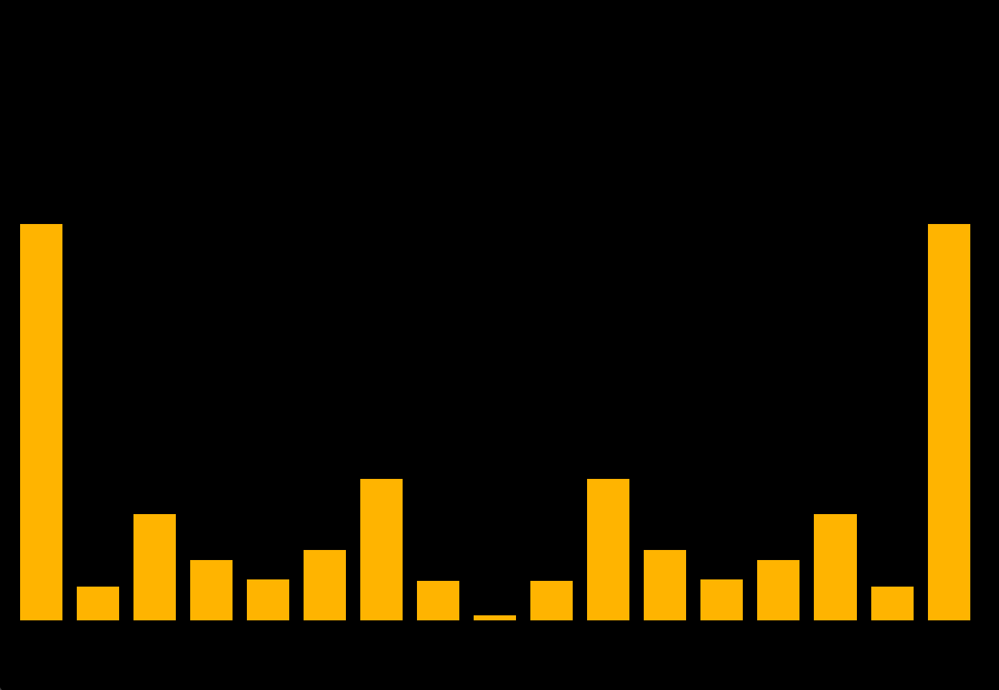

# WaveView
Waveview is a lightweight audio player & visualizer. It takes a `.wav` file as an argument, processes the raw data into frequency bins using a **Fast Fourier Transform**, and plays the sound back accompanied by the **EQ Visualizer**.

## Replicating
Simply clone the repository and build using `CMake` in a `build` directory. Run the executeable with the location of a `.wav` file as the first argument.

## Organization

### Engine
The `engine` class holds an instance of the other classes as fields and handles user input, graphical display, and sound output. When the user passes a filename to `main.cpp`, the engine is created given those parameters and builds the respective `AudioData` and `Playback` objects.

### Data Analysis
Audio data is handled by the `AudioData` class. The raw audio data in the specified file is decoded into a vector of floats. These floats are stored to both be transformed into frequency data, and also passed to `Playback.h` for audio playback.

`AudioData` breaks up the decoded samples into *windows* which are chunks of decoded audio samples. To smooth the data, the windows overlap by by a specified sample count, and a **Hann Window Function** is applied to each window. Then, it sends each window through a **Fast Fourier Transform** to extract the magnitude of each sample's frequency.

The frequency data is then stored into **bins**. The bins store the given magnitude of a particular frequency at a particular location in the audio. The maximum values of each bin can easily be configured in `AudioData.h`, and the number of bins can also be configured. The program will automatically adjust the number of bars in the visualizer.

### Playback
The normal decoded data from `AudioData` is passed to the playback. The playback then checks for audio output devices, and attempts to start the audio stream. It then repeatedly calls `audioCallback()` which defines an input buffer of samples from the data and pushes them to an output buffer.

### Graphics
The graphics engine initializes a number of bars which scale with the number of specified bins in `AudioData`. The engine has a standard loop:

* **Process Input**: Checks for the user to start the program or exit based on keybinds.

* **Update**: Checks the number of samples played in the Playback. Finds that location in the frequencyData, and resizes each bar to fit the magnitude of it's corresponding bin

* **Render**: Draw the shapes.

## Dependencies
This project fetches a number of libraries to reduce clutter.

* **KissFFT**: Handles the majority of computations involved in the Fast Fourier Transform.

* **RtAudio**: Used for audio playback, finds devices from the OS, sends audio data to the output devices.

* **OpenGL (glad, glfw, glm)**: Used for window creation and drawing shapes.

* **Freetype**: Used for drawing text w/ **OpenGL**.

* **Dr_wav**: Aids in reading `.wav` files.

#### Thanks for reading!